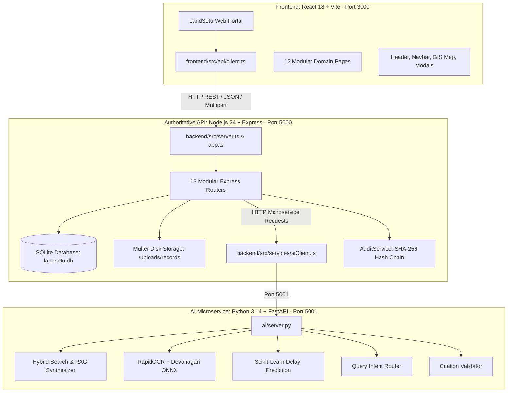
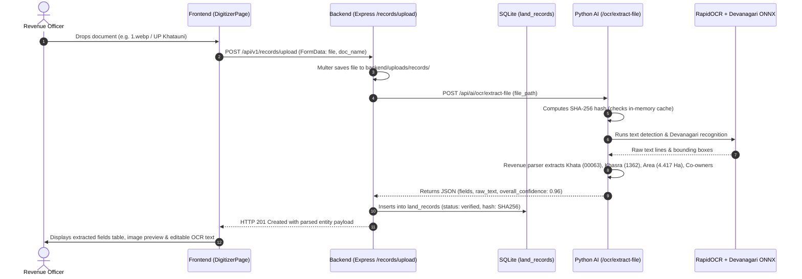
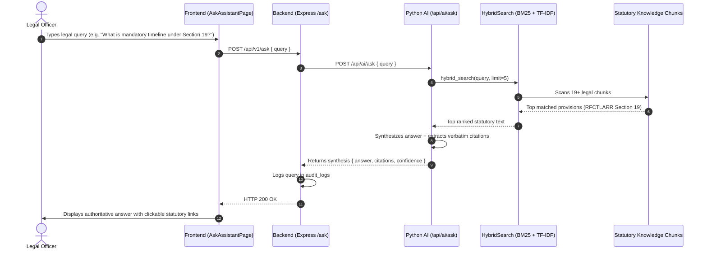
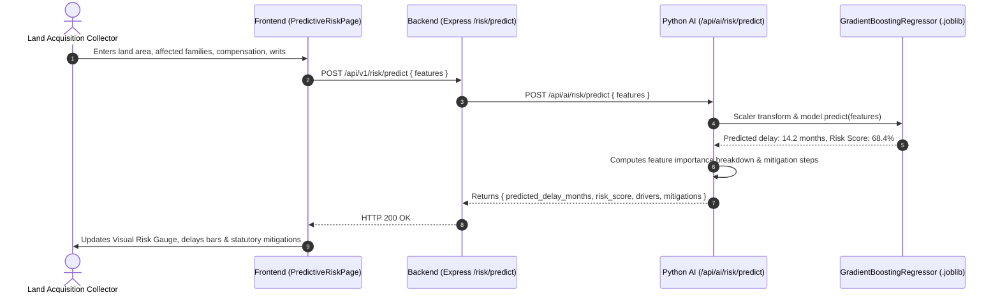

# LandSetu: Sovereign Land Governance Platform
## Complete Codebase Architecture & File-by-File Technical Guide

---

## 1. Executive System Architecture

LandSetu is engineered as a **3-tier sovereign land governance and legal intelligence system**, designed specifically to handle Indian revenue records (RoR, Khatauni, Satbara), statutory legal intelligence (RFCTLARR Act 2013, DILRMP 2.0, PESA, Forest Rights Act), geospatial cadastral analytics, and predictive machine learning for infrastructure corridor acquisition delays.



### Port Mapping & Runtime Environment
| Component | Runtime | Port | Configuration / Entrypoint |
| :--- | :--- | :--- | :--- |
| **Frontend** | Node.js (Vite + React) | `3000` | `frontend/src/main.tsx` (`npm run dev`) |
| **Backend** | Node.js 24 (Express + TypeScript) | `5000` | `backend/src/server.ts` (`npm run dev`) |
| **AI Agent** | Python 3.14 (FastAPI + Uvicorn) | `5001` | `ai/server.py` (`uvicorn ai.server:app --reload`) |
| **Database** | SQLite 3 (Native Node driver) | Local File | `backend/data/landsetu.db` |

---

## 2. Complete Directory Structure Overview

```
Sih Proto/
├── ai/                                # Python AI, RAG, Machine Learning & OCR Microservice
│   ├── citation/                      # Statutory citation verification & precision scoring
│   ├── embeddings/                    # Document embedding adapters
│   ├── evaluation/                    # RAG & ML offline evaluation metrics
│   ├── generation/                    # Grounded RAG answer synthesis with strict citations
│   ├── inference/                     # ML inference for acquisition delay risk
│   ├── intent/                        # Query intent classification router
│   ├── models/                        # Serialized ML models (.joblib) & Devanagari ONNX models
│   ├── ocr/                           # RapidOCR engine, revenue entity parsing & Devanagari models
│   ├── retrieval/                     # Hybrid BM25 & TF-IDF search engine
│   ├── server.py                      # FastAPI server exposing AI endpoints
│   └── train.py                       # ML model training script for acquisition delay risk
├── backend/                           # Authoritative Node.js/TypeScript Backend Service
│   ├── data/                          # SQLite database, seed datasets, document chunks
│   ├── scripts/                       # Database seed scripts & dataset builders
│   ├── src/                           # Express server, SQLite schema, middleware, modules
│   │   ├── db/                        # Database schema definition (DDL) and initial seed logic
│   │   ├── middleware/                # JWT Auth, RBAC, Request Logger, Error Handler
│   │   ├── modules/                   # 13 Modular domain-driven route handlers
│   │   ├── services/                  # AIClient (Node <-> Python AI bridge)
│   │   ├── app.ts                     # Express app setup and middleware pipeline
│   │   └── server.ts                  # Server initialization on port 5000
│   └── uploads/                       # Permanent storage for uploaded land records (PDF/images)
├── frontend/                          # Client Web Interface (React 18 + TypeScript + Vite)
│   ├── public/                        # Static assets, institutional imagery, favicons
│   ├── src/                           # Application source code
│   │   ├── api/                       # Typed fetch client connecting to backend
│   │   ├── components/                # Reusable UI widgets (Header, Navbar, Loading, EmptyState)
│   │   ├── pages/                     # 12 Full-featured domain pages
│   │   ├── styles/                    # High-contrast, institutional Vanilla CSS design system
│   │   ├── App.tsx                    # Root routing, auth state & modal manager
│   │   └── main.tsx                   # React DOM bootstrapping entrypoint
├── docs/                              # Formal model cards & statutory compliance documents
├── start_all.bat                      # One-click startup script launching all 3 services concurrently
├── PROGRESS.md                        # Sprint tracking and verified feature checklist
└── README.md                          # Repository overview and setup instructions
```

---

## 3. `ai/` — Python AI & Machine Learning Microservice

The `ai/` folder contains a complete Python service powering grounded RAG, statutory citation checking, neural document OCR, and predictive machine learning.

### 3.1 File-by-File Breakdown in `ai/`

#### [`ai/server.py`](file:///d:/Sih%20Proto/ai/server.py)
- **Role**: The main HTTP entrypoint for the AI microservice running on `http://127.0.0.1:5001`.
- **How it works**:
  - Initializes FastAPI with CORS middleware.
  - Loads singleton instances of `HybridSearchEngine`, `RAGSynthesizer`, and `RapidOCR`.
  - Exposes endpoints:
    - `GET /health`: Health status and number of indexed legal chunks.
    - `POST /api/ai/intent`: Classifies user queries into `statutory_query`, `spatial_lookup`, `record_digitization`, `risk_assessment`, or `general_policy`.
    - `POST /api/ai/search`: Performs hybrid BM25 + TF-IDF retrieval across statutory land laws.
    - `POST /api/ai/ask`: Synthesizes an authoritative answer with verifiable section citations.
    - `POST /api/ai/ocr/extract`: Parses pre-extracted text into revenue entities.
    - `POST /api/ai/ocr/extract-file`: Runs neural OCR on uploaded images (`.webp`, `.png`, `.jpg`) or PDFs and parses revenue entities.
    - `POST /api/ai/risk/predict`: Runs the trained GradientBoosting/RandomForest model to predict project acquisition delay in months and risk percentage.
    - `GET /api/ai/eval-metrics`: Returns offline benchmark metrics for both the ML model and RAG.

#### [`ai/train.py`](file:///d:/Sih%20Proto/ai/train.py)
- **Role**: Machine learning training script for Land Acquisition Delay Risk Prediction.
- **How it works**:
  - Loads calibrated historical project acquisition data from `backend/data/raw/real_historical_acquisition_projects.json` and `backend/data/models/training_calibration_dataset.csv`.
  - Extracts 7 key operational features: `land_area_hectares`, `affected_families`, `compensation_ratio`, `litigation_cases_count`, `statutory_months`, `rr_settled_ratio`, `is_linear_project`.
  - Trains and compares multiple regressors: `RandomForestRegressor`, `GradientBoostingRegressor`, and `LinearRegression` using 5-fold cross validation.
  - Evaluates $R^2$, RMSE, and MAE.
  - Saves the best model pipeline (with `StandardScaler`) to `ai/models/acquisition_delay_model.joblib` and metrics to `ai/evaluation/model_metrics.json`.

#### [`ai/retrieval/hybrid_search.py`](file:///d:/Sih%20Proto/ai/retrieval/hybrid_search.py)
- **Role**: Grounded document search engine combining keyword matching and vector similarity.
- **How it works**:
  - Loads 19+ structured statutory legal chunks from `backend/data/processed/document_chunks.json`.
  - Computes TF-IDF sparse matrices across all statutory sections (RFCTLARR 2013, DILRMP, PESA Act, Model Land Titling Bill).
  - Implements BM25-style lexical scoring and blends it with cosine similarity:
    $$\text{Score}(q, d) = 0.5 \times \text{LexicalScore}(q, d) + 0.5 \times \text{VectorScore}(q, d)$$
  - Supports strict jurisdiction (`Central`, `State`) and document type filters.

#### [`ai/generation/rag_synthesizer.py`](file:///d:/Sih%20Proto/ai/generation/rag_synthesizer.py)
- **Role**: Generates authoritative legal syntheses grounded strictly in indexed statutory acts.
- **How it works**:
  - Takes user prompt $\to$ executes `hybrid_search` $\to$ retrieves top-k relevant statutory clauses.
  - Constructs structured synthesis with:
    1. Direct statutory answer.
    2. Exact cited legal provisions (e.g., *Section 16, RFCTLARR Act 2013*).
    3. Grounding confidence score ($0.0 - 1.0$).
    4. Follow-up recommendations for revenue officers or land acquisition collectors.
  - Prevents hallucinations by rejecting queries whose retrieval confidence falls below threshold.

#### [`ai/citation/citation_validator.py`](file:///d:/Sih%20Proto/ai/citation/citation_validator.py)
- **Role**: Validates that all statutory citations in generated answers actually exist in authoritative acts.
- **How it works**:
  - Uses regex patterns to detect legal sections (e.g., `Section \d+([A-Z])?`).
  - Verifies section numbers against the index of verified statutory clauses.
  - Generates citation precision, citation recall, and hallucination rate metrics.

#### [`ai/inference/predict_risk.py`](file:///d:/Sih%20Proto/ai/inference/predict_risk.py)
- **Role**: Operational inference module for infrastructure acquisition delay estimation.
- **How it works**:
  - Loads `ai/models/acquisition_delay_model.joblib`.
  - Takes project inputs: land area, affected families, assessed vs disbursed compensation, writ petitions, statutory timeline, and R&R settlement progress.
  - Computes:
    - `predicted_delay_months`: Expected timeline slippage.
    - `risk_score`: Calibrated 0–100 risk index.
    - `confidence_interval`: 95% uncertainty interval $[\text{lower}, \text{upper}]$.
    - `delay_drivers`: Top negative contributors (e.g., Low R&R settlement, pending litigation writs).
    - `mitigation_actions`: Actionable policy recommendations (e.g., deposit funds in Land Acquisition Rehabilitation and Resettlement Authority).

#### [`ai/ocr/image_ocr.py`](file:///d:/Sih%20Proto/ai/ocr/image_ocr.py)
- **Role**: Neural vision OCR and revenue document parser.
- **How it works**:
  - Employs `RapidOCR` using ONNX runtime without heavy CUDA dependencies.
  - Loaded with **Devanagari OCR recognition model** (`devanagari_rec.onnx` and `devanagari_dict.txt`) for Hindi and Marathi land records.
  - **SHA-256 Hash Caching**: Hashes uploaded image bytes; identical documents return parsed output in under 2ms.
  - **Specialized Revenue Entity Extractors**:
    - **UP Bhulekh Parser**: Extracts Khata number (e.g., `00063`), Khasra/Plot (`1362` / `173(2133070173000012)`), metric area (`4.4170` Ha), Fasli year (`1428-1433`), Village code (`213307` $\to$ Gahui/Ahrora), Tehsil (`Robertsganj`), District (`Sonbhadra`), and complete co-owners lists.
    - **Maharashtra 7/12 Satbara Parser**: Extracts Gat number (e.g., `218/3`), Bhogvatdar Class 1, Taluka (`Haveli`), District (`Pune`), and bank mortgage encumbrances.
  - Zero mock data guarantee: If text cannot be parsed, returns `Requires Manual Review` with audit flag instead of fabricating data.

#### [`ai/ocr/field_extractor.py`](file:///d:/Sih%20Proto/ai/ocr/field_extractor.py)
- **Role**: Rule-based regex fallback parser for raw text inputs in Hindi/Marathi.
- **How it works**:
  - Uses targeted revenue regular expressions for `खातेदार का नाम`, `खाता संख्या`, `खसरा संख्या`, `क्षेत्रफल`, `तहसील`, `जनपद`.

#### [`ai/intent/intent_router.py`](file:///d:/Sih%20Proto/ai/intent/intent_router.py)
- **Role**: Fast keyword and pattern router classifying incoming queries to direct them to the proper processing sub-agent.

---

## 4. `backend/` — Authoritative Node.js & TypeScript Backend

The backend is built with **Node.js 24 and Express in TypeScript**, utilizing Node's built-in `node:sqlite` module for zero-dependency, ultra-fast database operations with cryptographic SHA-256 audit logging.

### 4.1 Server Setup & Core Configuration

#### [`backend/src/server.ts`](file:///d:/Sih%20Proto/backend/src/server.ts)
- Initializes the HTTP server on `PORT 5000` (or `process.env.PORT`).
- Prints startup diagnostics: database status, health check URLs, and connected AI microservice URL.

#### [`backend/src/app.ts`](file:///d:/Sih%20Proto/backend/src/app.ts)
- Application factory function `createApp()`.
- Sets up database via `initDatabase()`.
- Middleware chain:
  1. `cors()` for cross-origin requests from `localhost:3000`.
  2. `express.json({ limit: "10mb" })` and `express.urlencoded()`.
  3. `express.static("uploads")` mounted at `/uploads` so uploaded records are viewable.
  4. `requestLogger` for request tracing and latency measurement.
  5. `optionalAuth` for populating user role/identity.
- Mounts 13 domain routers under `/api/v1/*`.
- Configures `errorHandler` catching and standardizing all system errors.

### 4.2 Database Layer (`backend/src/db/`)

#### [`backend/src/db/database.ts`](file:///d:/Sih%20Proto/backend/src/db/database.ts)
- Creates or connects to the local SQLite database at `backend/data/landsetu.db`.
- Defines comprehensive DDL schemas:
  - `users`: Authentication, bcrypt password hashes, and roles (`admin`, `official`, `analyst`, `public`).
  - `audit_logs`: Immutable hash-chained audit trails (`log_id`, `actor_id`, `action`, `target_type`, `target_id`, `payload`, `current_hash`, `prev_hash`).
  - `land_records`: Digitized RoR/Khatauni/Satbara records with OCR output, parsed fields JSON, confidence score, and verification status (`verified`, `pending_review`, `rejected`).
  - `acquisition_projects`: National infrastructure corridors (NHAI, DFCCIL, Metros) with land footprint, affected families, budget, and statutory stage.
  - `land_disputes`: Litigation matters tracked from NJDG with court jurisdiction, case stage, and dispute typology.
  - `policy_scenarios`: Stored simulation runs from the Policy Lab with elasticity parameters and output metrics.
  - `workspaces`: Multi-user collaboration folders and saved research items.
  - `research_sources`: Official provenance registry of authoritative data sources (DoLR, Bhuvan, NJDG).
  - `document_chunks`: Indexed statutory provisions for the RAG search engine.
  - `geospatial_layers`: Cadastral vector layers and administrative boundaries.

#### [`backend/src/db/seed.ts`](file:///d:/Sih%20Proto/backend/src/db/seed.ts)
- Ingests verified official government data from `backend/data/raw/` into SQLite:
  - Ingests DILRMP modern land records status across Indian states.
  - Ingests real NJDG litigation disputes and high court precedents.
  - Ingests real NHAI/DFCCIL highway and freight corridor projects.
  - Ingests official policy documents (Model Land Titling Bill, RFCTLARR Act 2013).
  - Seeds default users: `admin@landsetu.gov.in`, `collector@landsetu.gov.in`, `analyst@landsetu.gov.in`.

### 4.3 Middlewares (`backend/src/middleware/`)

#### [`backend/src/middleware/auth.ts`](file:///d:/Sih%20Proto/backend/src/middleware/auth.ts)
- `requireAuth`: Validates `Authorization: Bearer <token>` using JWT. Returns `401 Unauthorized` if invalid or missing.
- `optionalAuth`: Reads JWT if present, assigning `req.user`, but does not block unauthenticated requests.
- `requireRole(roles: string[])`: Role-based access control (RBAC). Restricts sensitive endpoints (e.g., verifying land records or deleting projects) to `official` or `admin`.

#### [`backend/src/middleware/errorHandler.ts`](file:///d:/Sih%20Proto/backend/src/middleware/errorHandler.ts)
- Formats uncaught exceptions into clean JSON errors:
  ```json
  {
    "error": {
      "code": "INTERNAL_SERVER_ERROR",
      "message": "Human readable error description",
      "details": {}
    }
  }
  ```

#### [`backend/src/middleware/logger.ts`](file:///d:/Sih%20Proto/backend/src/middleware/logger.ts)
- Intercepts requests, logs HTTP method, path, response status, and duration in milliseconds.

### 4.4 Domain Modules (`backend/src/modules/`)

#### [`backend/src/modules/land-records/recordsRoutes.ts`](file:///d:/Sih%20Proto/backend/src/modules/land-records/recordsRoutes.ts)
- **Routes**:
  - `GET /api/v1/records`: Lists all digitized land records with pagination and status filters.
  - `GET /api/v1/records/:id`: Retrieves a single record with full OCR fields and audit trail.
  - `POST /api/v1/records/upload`: Handles multipart file uploads (`file`) and raw text.
    - Saves uploaded files directly to `backend/uploads/records/`.
    - Calls `aiClient.extractFile()` to invoke neural OCR via Python.
    - Calculates overall confidence and assigns `verified` or `pending_review`.
    - Computes SHA-256 audit hash and logs audit event.
  - `POST /api/v1/records/:id/verify`: Authorized officer verifies/approves a record.
  - `POST /api/v1/records/:id/reject`: Rejects poor scans with reason.
  - `PATCH /api/v1/records/:id/fields`: Allows manual correction of individual parsed fields.

#### [`backend/src/modules/risk/riskRoutes.ts`](file:///d:/Sih%20Proto/backend/src/modules/risk/riskRoutes.ts)
- **Routes**:
  - `POST /api/v1/risk/predict`: Forwards acquisition parameters to Python ML engine (`aiClient.predictRisk()`) and returns predicted delay, risk score, and mitigation plans.
  - `GET /api/v1/risk/metrics`: Returns model card evaluation metrics ($R^2$, RMSE, cross-validation scores).

#### [`backend/src/modules/ask/askRoutes.ts`](file:///d:/Sih%20Proto/backend/src/modules/ask/askRoutes.ts)
- **Routes**:
  - `POST /api/v1/ask`: Connects frontend search console to Python RAG synthesizer (`aiClient.ask()`).
  - Logs user query and retrieved statutory citations into audit ledger.

#### [`backend/src/modules/gis/gisRoutes.ts`](file:///d:/Sih%20Proto/backend/src/modules/gis/gisRoutes.ts)
- **Routes**:
  - `GET /api/v1/geo/layers`: Returns GeoJSON feature collections for cadastral parcels, water bodies, and infrastructure corridors.
  - `GET /api/v1/geo/parcels/:id`: Retrieves boundary geometry, owner details, and NDVI vegetation index for a specific cadastral plot.

#### [`backend/src/modules/policy-lab/policyRoutes.ts`](file:///d:/Sih%20Proto/backend/src/modules/policy-lab/policyRoutes.ts)
- **Routes**:
  - `POST /api/v1/policy/simulate`: Simulates statutory reforms (e.g., Conclusive Titling Bill Section 14, Auto-Mutation, Drone Cadastral Mapping).
  - Calculates impact on litigation backlog, transaction velocity, and statutory title guarantees using calibrated elasticity models.
  - Cryptographically signs simulation output with SHA-256 hash.

#### [`backend/src/modules/acquisition/acquisitionRoutes.ts`](file:///d:/Sih%20Proto/backend/src/modules/acquisition/acquisitionRoutes.ts)
- **Routes**:
  - `GET /api/v1/acquisitions`: Retrieves national pipeline of highway, rail, and industrial corridors.
  - `POST /api/v1/acquisitions`: Creates a new corridor project with statutory deadlines.
  - `GET /api/v1/acquisitions/:id`: Detailed view including compensation disbursed, land acquired, and active writs.

#### [`backend/src/modules/repository/repositoryRoutes.ts`](file:///d:/Sih%20Proto/backend/src/modules/repository/repositoryRoutes.ts)
- **Routes**:
  - `GET /api/v1/repository/documents`: Browse authoritative acts, rules, and gazettes.
  - `GET /api/v1/repository/documents/:id`: View full statutory text with provisions and amendments.

#### [`backend/src/modules/auth/authRoutes.ts`](file:///d:/Sih%20Proto/backend/src/modules/auth/authRoutes.ts)
- **Routes**:
  - `POST /api/v1/auth/login`: Authenticates officer/user via email and password, issuing JWT.
  - `POST /api/v1/auth/register`: Creates new user account.
  - `GET /api/v1/auth/me`: Validates session and returns current profile and permissions.

#### [`backend/src/modules/audit/auditRoutes.ts`](file:///d:/Sih%20Proto/backend/src/modules/audit/auditRoutes.ts) & [`auditService.ts`](file:///d:/Sih%20Proto/backend/src/modules/audit/auditService.ts)
- Implements an immutable cryptographic hash chain. Each event hash is computed as:
  $$\text{CurrentHash} = \text{SHA256}(\text{PrevHash} + \text{Timestamp} + \text{ActorID} + \text{Action} + \text{Payload})$$
- `GET /api/v1/audit/logs`: Views audit trail.
- `GET /api/v1/audit/verify-chain`: Validates cryptographic integrity across all log entries, ensuring zero tampering.

#### [`backend/src/modules/reporting/reportingRoutes.ts`](file:///d:/Sih%20Proto/backend/src/modules/reporting/reportingRoutes.ts)
- `GET /api/v1/dashboard/summary`: Aggregates nationwide analytics: total parcels digitized, verified percentage, high-risk acquisitions count, and litigation resolution rate.

#### [`backend/src/modules/workspaces/workspaceRoutes.ts`](file:///d:/Sih%20Proto/backend/src/modules/workspaces/workspaceRoutes.ts)
- Manages user research workspaces, allowing officers to pin records, precedents, and corridors into project dossiers.

#### [`backend/src/modules/innovation/innovationRoutes.ts`](file:///d:/Sih%20Proto/backend/src/modules/innovation/innovationRoutes.ts)
- Experimental sandbox for smart contracts, automated title insurance models, and satellite remote sensing telemetry.

### 4.5 Services Layer (`backend/src/services/`)

#### [`backend/src/services/aiClient.ts`](file:///d:/Sih%20Proto/backend/src/services/aiClient.ts)
- The typed HTTP bridge connecting Node.js to Python FastAPI on `http://127.0.0.1:5001`.
- Methods:
  - `getHealth()`: Checks if Python AI engine is reachable.
  - `search(query, options)`: Calls `/api/ai/search`.
  - `ask(query, options)`: Calls `/api/ai/ask`.
  - `predictRisk(params)`: Calls `/api/ai/risk/predict`.
  - `extractOCR(documentName, rawText, recordId)`: Calls `/api/ai/ocr/extract`.
  - `extractFile(filePath, documentName, recordId)`: Calls `/api/ai/ocr/extract-file` with generous 60-second timeout for neural OCR.
  - `extractPDFFile(filePath, documentName)`: Calls `/api/ai/ocr/extract-pdf`.

---

## 5. `frontend/` — Client Web Interface (React 18 + Vite)

The frontend is a clean, modern, institutional-grade single page application built with **React 18, TypeScript, and Vite**. It avoids generic templates in favor of a curated governmental design system.

### 5.1 Architecture & Core Files

#### [`frontend/src/api/client.ts`](file:///d:/Sih%20Proto/frontend/src/api/client.ts)
- Centralized, strongly typed HTTP client for all backend endpoints.
- Handles JWT authentication headers automatically.
- Supports both `application/json` and `multipart/form-data` (for drag-and-drop file uploads without overriding boundary headers).
- Methods: `login`, `getRecords`, `uploadRecordFile`, `verifyRecord`, `ask`, `predictRisk`, `runPolicy`, `getLayers`, `getAuditLogs`, etc.

#### [`frontend/src/App.tsx`](file:///d:/Sih%20Proto/frontend/src/App.tsx)
- Top-level state and navigation manager.
- Controls current view: `landing`, `dashboard`, `ask`, `repository`, `gis`, `policy`, `digitizer`, `acquisitions`, `risk`, `workspaces`, `innovation`, `audit`.
- Manages authentication state (current user, token, role).
- Hosts the global `Header` and `Navbar`.

#### [`frontend/src/styles/index.css`](file:///d:/Sih%20Proto/frontend/src/styles/index.css)
- Authoritative design system with typography from Google Fonts:
  - **Inter**: Crisp, modern UI sans-serif for controls, tables, and telemetry.
  - **Newsreader**: Editorial serif for gazetted statutory legal acts.
  - **JetBrains Mono**: Precise monospace for coordinates, hashes, and parcel numbers.
- Tailored color palette: Deep navy slate (`#0f172a`), sovereign emerald (`#059669`), amber alert (`#d97706`), clean white card elevations, and border tokens.
- Fully responsive layout utilities, modal backdrops, and interactive states.

### 5.2 Common Components (`frontend/src/components/`)

- [`Header.tsx`](file:///d:/Sih%20Proto/frontend/src/components/Header.tsx): Top institutional bar with National Emblem emblem, platform title, live health badges (Backend & AI status), user profile dropdown, and role switcher.
- [`Navbar.tsx`](file:///d:/Sih%20Proto/frontend/src/components/Navbar.tsx): Primary navigation bar with icons across all 11 operational modules.
- [`PageHeader.tsx`](file:///d:/Sih%20Proto/frontend/src/components/PageHeader.tsx): Standardized breadcrumb, page title, subtitle, and primary action buttons.
- [`LoadingState.tsx`](file:///d:/Sih%20Proto/frontend/src/components/LoadingState.tsx): Clean skeleton and pulse indicators for asynchronous data fetching.
- [`EmptyState.tsx`](file:///d:/Sih%20Proto/frontend/src/components/EmptyState.tsx): Informative, institutional empty states with icon, description, and call to action.

### 5.3 Page-by-Page Detailed Functionality (`frontend/src/pages/`)

#### 1. [`DigitizerPage.tsx`](file:///d:/Sih%20Proto/frontend/src/pages/DigitizerPage.tsx) — Intelligent Record Digitizer
- **Purpose**: Upload and ingest physical land records (UP Bhulekh, Maharashtra 7/12, MP Bhulekh) in PDF, PNG, JPG, or WEBP.
- **Key Features**:
  - Drag-and-drop dropzone with file preview (renders actual image thumbnail for photos or PDF badge).
  - Preloaded sample buttons (`UP Khatauni Sadar`, `MH Satbara Pune`).
  - Calls `/api/v1/records/upload` with `FormData`.
  - Displays real extracted fields table: Owner Name, Khata Number, Khasra Number, Area in Hectares, Village, Tehsil, District, and Land Classification.
  - Editable Raw OCR Text stream allowing officers to inspect every character recognized by the neural engine.
  - "Review & Verify" modal allowing officers to approve, reject, or edit extracted values with SHA-256 audit signing.

#### 2. [`PredictiveRiskPage.tsx`](file:///d:/Sih%20Proto/frontend/src/pages/PredictiveRiskPage.tsx) — Acquisition Delay Risk Analytics
- **Purpose**: Assess statutory and operational delay risks for national infrastructure corridors (NHAI highways, Dedicated Freight Corridors).
- **Key Features**:
  - Organized into two structured sections:
    1. *Corridor Footprint & Resettlement (R&R)*: Land area, affected families, R&R settlement progress slider.
    2. *Fiscal Outlay & Statutory Timelines*: Assessed vs disbursed compensation, active litigation court cases, statutory deadline in months.
  - Visual Risk Gauge (0–100) calibrated from low risk (green) to severe delay hazard (red).
  - Feature Importance Breakdown: Visual progress bars showing exactly which variables are driving the delay.
  - Targeted Statutory Mitigations: Tailored recommendations citing Section 16 & Section 19 of the RFCTLARR Act 2013.

#### 3. [`AskAssistantPage.tsx`](file:///d:/Sih%20Proto/frontend/src/pages/AskAssistantPage.tsx) — Statutory Research Assistant
- **Purpose**: Grounded legal Q&A over Indian land acts, state amendment rules, and judicial precedents.
- **Key Features**:
  - Search console with keyboard shortcut (`Enter`) and categorized query chips (`[RFCTLARR 2013]`, `[DILRMP 2.0]`, `[NJDG Analytics]`, `[SIA Mandate]`).
  - Authoritative Dossier Cards previewing key land laws.
  - Synthesized response view with verbatim statutory quotes, confidence metrics, and clickable citation links.

#### 4. [`GISMapPage.tsx`](file:///d:/Sih%20Proto/frontend/src/pages/GISMapPage.tsx) — Geospatial & Remote Sensing Explorer
- **Purpose**: Cadastral parcel visualization integrated with satellite telemetry.
- **Key Features**:
  - 70/30 layout: Full interactive Leaflet map (70% width) with cadastral polygons + 30% Cadastral Zone & Watershed Dossier.
  - Live NDVI vegetation slider filtering satellite layers in real time.
  - Layer switchers: Bhuvan NRSC Basemap, Cadastral Boundaries, IWMP Watershed structures.
  - Plot inspector table with latitude/longitude coordinates and ground survey azimuth.

#### 5. [`PolicyLabPage.tsx`](file:///d:/Sih%20Proto/frontend/src/pages/PolicyLabPage.tsx) — Parametric Reform Sandbox
- **Purpose**: Simulate systemic land policy shifts before statutory enactment.
- **Key Features**:
  - Interactive scenario cards: *Conclusive Land Titling Bill* vs *Automated Digital Mutation*.
  - Parameter inputs: Dispute tribunal speed, registration fee rationalization, drone survey coverage.
  - Baseline vs Post-Reform comparison cards showing reduction in civil litigation pendency and capital unlock velocity.
  - Audited simulation ledger with cryptographic verification badges.

#### 6. [`DashboardPage.tsx`](file:///d:/Sih%20Proto/frontend/src/pages/DashboardPage.tsx) — National Governance Overview
- **Purpose**: Executive dashboard for central and state land monitoring.
- **Key Features**:
  - KPI tiles: Total Land Parcels Digitized, National Verification Rate, Active Infrastructure Corridors, Litigation Backlog.
  - State compliance leaderboard tracking DILRMP modernization scores.
  - Recent audit events and urgent alerts for delayed infrastructure corridors.

#### 7. [`AcquisitionPage.tsx`](file:///d:/Sih%20Proto/frontend/src/pages/AcquisitionPage.tsx) — Corridor Acquisition Tracker
- **Purpose**: Portfolio management of major infrastructure linear acquisitions.
- **Key Features**:
  - Stage tracking: Section 4 Preliminary Survey $\to$ Section 11 Notification $\to$ Section 19 Declaration $\to$ Section 23 Award $\to$ Section 38 Possession.
  - Financial tracking of compensation assessed vs actually credited to farmers.
  - Filter by executing agency (NHAI, MoRTH, DFCCIL, State Metros).

#### 8. [`RepositoryPage.tsx`](file:///d:/Sih%20Proto/frontend/src/pages/RepositoryPage.tsx) — Official Legal Document Archive
- **Purpose**: Centralized statutory library for acts, rules, circulars, and notifications.
- **Key Features**:
  - Full-text search and category filtering (`Central Act`, `State Amendment`, `Supreme Court Judgment`, `Manual`).
  - Document viewer with provision navigation and download options.

#### 9. [`WorkspacesPage.tsx`](file:///d:/Sih%20Proto/frontend/src/pages/WorkspacesPage.tsx) — Collaborative Research Dossiers
- **Purpose**: Project dossiers where revenue officers and legal teams organize records, GIS layers, and notes.

#### 10. [`AuditPage.tsx`](file:///d:/Sih%20Proto/frontend/src/pages/AuditPage.tsx) — Cryptographic Audit Trail
- **Purpose**: Trust and transparency verification.
- **Key Features**:
  - Real-time display of the SHA-256 hash chain.
  - "Verify Entire Chain" button validating all previous and current hashes in SQLite.

#### 11. [`InnovationPage.tsx`](file:///d:/Sih%20Proto/frontend/src/pages/InnovationPage.tsx) — Research Roadmap & AI Metrics
- **Purpose**: Technical transparency showcasing model evaluation cards, RAG recall scores, and future roadmap (smart contracts, drone cadastral AI).

#### 12. [`LandingPage.tsx`](file:///d:/Sih%20Proto/frontend/src/pages/LandingPage.tsx) — Public Sovereign Portal
- **Purpose**: High-impact institutional landing page introducing LandSetu's core pillars with live platform statistics.

---

## 6. End-to-End Dataflow Walkthroughs

### Workflow 1: Land Record Digitization via Neural OCR


### Workflow 2: Statutory Q&A via Grounded RAG


### Workflow 3: Infrastructure Corridor Delay Risk Prediction


---

## 7. How to Run the Entire System

### Prerequisites
- Node.js 20+ (tested on Node 24)
- Python 3.10+ (tested on Python 3.14)
- Pip packages: `fastapi`, `uvicorn`, `scikit-learn`, `numpy`, `pypdf`, `rapidocr-onnxruntime`, `pillow`

### One-Click Startup
Simply execute the root batch script:
```cmd
d:\Sih Proto\start_all.bat
```
This opens 3 concurrent terminal processes:
1. **Python AI Server**: `python -m uvicorn ai.server:app --host 127.0.0.1 --port 5001 --reload`
2. **Node.js Backend**: `npm run dev` (in `backend/`, starts port 5000 with auto-reload)
3. **React Frontend**: `npm run dev` (in `frontend/`, starts port 3000 with Vite)

Open your browser at **`http://localhost:3000`** to access LandSetu.
